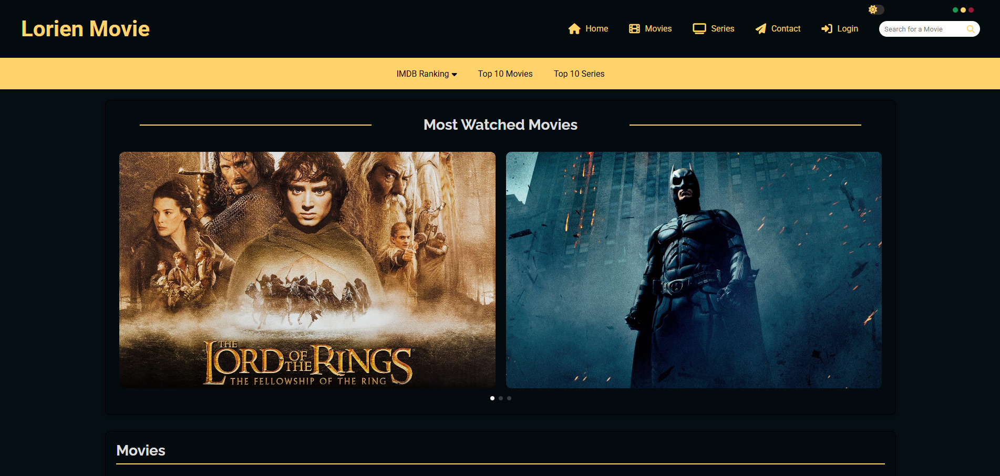
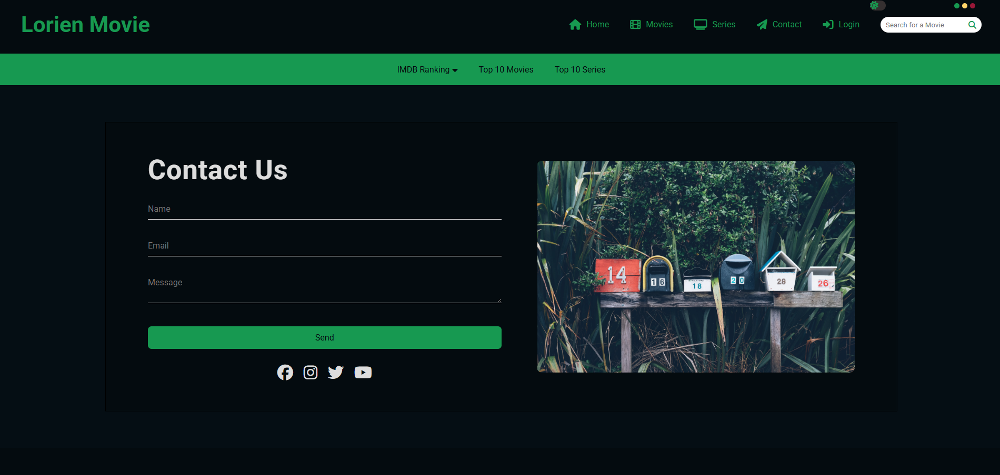
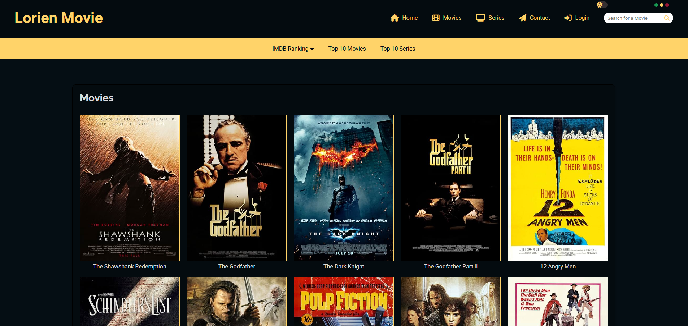
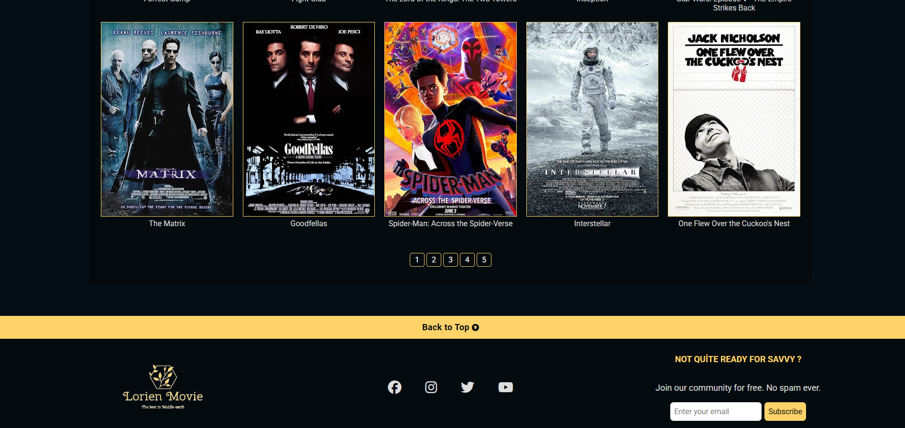
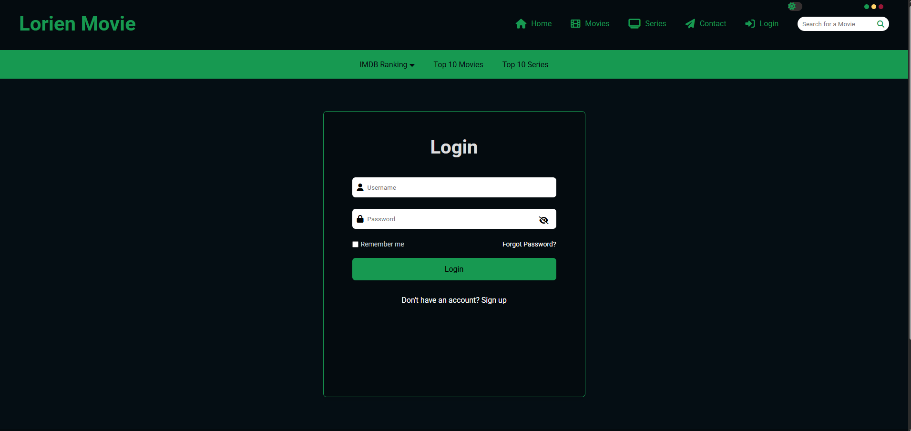

# 🎬 Lorien Movie

**Lorien Movie** is a modern movie and series web application built with React.  
It allows users to explore IMDb’s Top 100 movies and series, search for titles, switch themes, and view the top 10 most popular picks.  
All data is fetched from a real API, providing live and accurate information.

**🟢 Live Demo:** [https://lorien-movie.netlify.app/movies](https://lorien-movie.netlify.app/movies)

---

## 🖼️ Screenshots







---

## 🚀 Features

- 🎯 Browse IMDb Top 100 movies and series  
- 🔍 Search for specific titles  
- 🎨 Toggle between light and dark themes  
- 🏆 View top 10 movies and series  
- 📱 Fully responsive design  
- ⚡ Real API integration for live data  
- ⚛️ Built with React for a fast, smooth experience  

---

## 🛠️ Built With

- [React.js](https://react.dev/)  
- [React Router](https://reactrouter.com/)  
- [Fetch API](https://developer.mozilla.org/en-US/docs/Web/API/Fetch_API)  
- [CSS / SCSS]  
- [JavaScript (ES6+)]  
- 🎬 Movie data fetched from [IMDb Top 100 API - RapidAPI](https://rapidapi.com/rapihub-rapihub-default/api/imdb-top-100-movies)

---

## 📦 Getting Started

To run this project locally:

```bash
# Clone the repository
git clone https://github.com/KKocbeler/lorien-movie.git

# Go to the project folder
cd lorien-movie

# Install dependencies (this will download all required files and packages)
npm install

# Start the development server
npm run dev